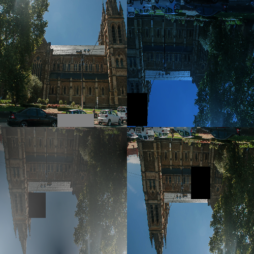

# Temple Classification
The repository contains the prediction code for a classifier that could guess which country the temple is in. The code gets the path to a directory with images as a parameter, and returns a CSV file with the results.

## Setup
### Prerequisites
|library|version|
|----|----|
|numpy|1.22.1|
|opencv-python|4.5.5.62|
|pandas|1.4.0|
|Pillow|9.0.0|
|python-dateutil|2.8.2|
|pytz|2021.3|
|six|1.16.0|
|torch|1.10.1|
|torchvision|0.11.2|
|typing_extensions|4.0.1|

### Steps for installing requirements
`pip3 install -r requirements.txt`

## Usage
`bash predict.sh --input_path [PATH TO IMAGE DIRECTORY]`

### Helper for the bash script
`bash predict.sh --help`

> input_path is a required field; others are optional the default value is mentioned in [] 

### Training Process of prediction model

### Data Augmentation

  

### Results of Test Set
|Model|Accuracy|Weights|
|----|----|----|
|EfficientNet B3|84.61|[effb3weights](targetURL)|
|EfficientNet B0|81.24|[effb0weights](targetURL)|
|VGG16|79.84|[vggweights](targetURL)|
