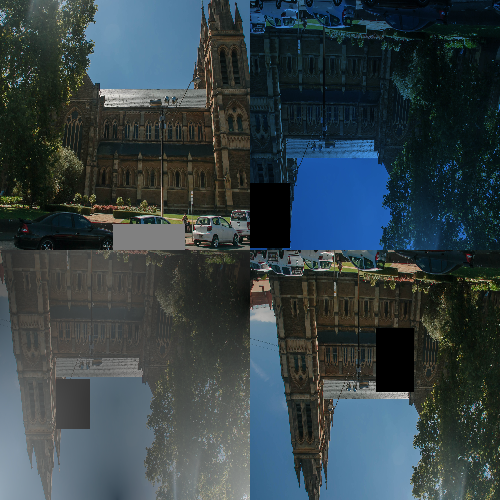
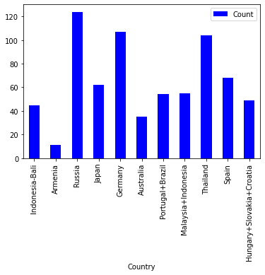
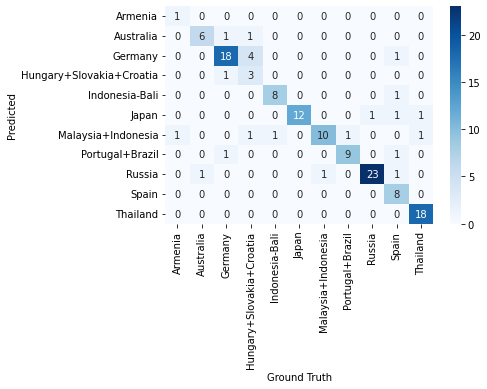
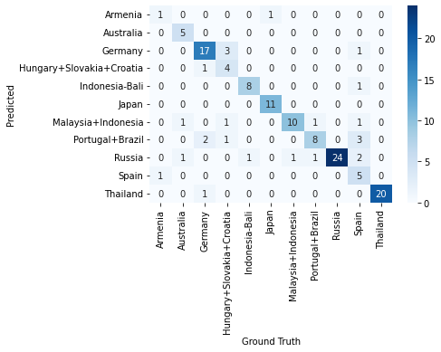
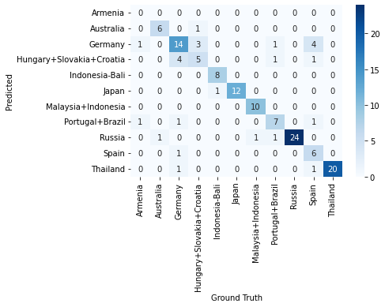
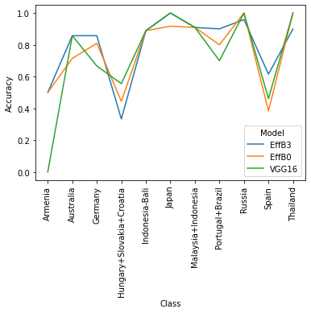

# Toptal Screening Assisnment
The repository contains the prediction code for a classifier that could guess which country the temple is in. The code gets the path to a directory with images as a parameter, and returns a CSV file with the results.
The solution has option of three pretrained models: Efficient Net B3, Efficient B0, VGG16. Efficient Net B3 is the default model since it gives the highest accuracy.

## Setup
### Requirements
|library|version|
|----|----|
|numpy|1.22.1|
|opencv-python|4.5.5.62|
|pandas|1.4.0|
|Pillow|9.0.0|
|python-dateutil|2.8.2|
|pytz|2021.3|
|six|1.16.0|
|torch|1.10.1|
|torchvision|0.11.2|
|typing_extensions|4.0.1|

### Steps for installing requirements
`pip3 install -r requirements.txt`

## Usage
`bash predict.sh --input_path [PATH TO IMAGE DIRECTORY] --model [MODEL NAME] --pretrained_path [Path of the Pretrained Model] --output_dir [Path to the directory where output will be written] --image_shape [Dimension of the input shape]`
### Arguments
|Argument|Required/Optional|Meaning|
|----|----|----|
|--input_path|Required|Path of the Input Directory
|--model|Optional [Default: EFFB3]|Prediction Model to be used
|--pretrained_path|Optional [Default: models/temple-classifier-eff-best.pt]|Path of the pretrained model
|--output_dir|Optional [Default: data/output/]|Path of the Output Directory
|--image_shape|Optional [Default: 300]|Width and Height of the image

### Examples
* `bash predict.sh --input_path data/input/`
* `bash predict.sh --input_path data/input/ --model EFFB0 --pretrained_path models/temple-classifier-effb0.pt --image_shape 224`
* `bash predict.sh --input_path data/input/ --model VGG16 --pretrained_path models/temple-classifier-vgg.pt --image_shape 224`

> Paste the pretrained models downloaded from the link below in the models file

### Helper for the bash script
`bash predict.sh --help`

### Training Process of prediction model
The images were divided in training and test dataset on a 80:20 split.

After Training-Testing split, the distribution is as follows

Category|#Images
-----|-----
Train|576
Test|138

Data augmentation was performed on training data.

The following augmentation techniques were applied:
* Random 90 Degree Rotation
* Random Crop
* Adding Gaussian Noise
* Adding Fog like noise
* Changing the color temperature(to give a night likeview)
* Redacting Random Parts of image 

  

Data Augmentation is applied such that each class is augmented till we reach to a max of 400 image per class or we have augmented each image with a factor of 10

### Distribution of Each Class **Before** Augmentation

  

Class|Count
-----|-----
Australia|28
Indonesia-Bali|36
Germany|86
Armenia|9
Portugal+Brazil|44
Japan|50
Thailand|84
Spain|55
Malaysia+Indonesia|44
Hungary+Slovakia+Croatia|40
Russia|100
**Total**|576

### Distribution of Each Class **After** Augmentation

Class|CountOfImagesAfterAugmentation
-----|-----
Australia|280
Indonesia-Bali|360
Germany|400
Armenia|90
Portugal+Brazil|400
Japan|400
Thailand|400
Spain|400
Malaysia+Indonesia|400
Hungary+Slovakia+Croatia|400
Russia|400
**Total**|3930

> Each class of augmented train image is now randomly split into train and val dataset in 80:20

### Final Distribution of Data
Category|#Images
-----|-----
train|3144
val|786
test|138

### Training the model
The model is now finetuned on various CNN architectures trained on Imagenet data, Following changes are made to each of the net
* The size of the final layer is changed to suit the dataset making the size to x,11, *x is the size of the output of the previous layer*
* The weights of all but last CNN layer is freezed during the training process 

### Results of Test Set
|Model|Accuracy|Weights|
|----|----|----|
|EfficientNet B3|84.061|[effb3weights](https://drive.google.com/file/d/12rduB0SrQSS3QgVoPfuKmhANwjXsxNF1/view?usp=sharing)|
|EfficientNet B0|81.88|[effb0weights](https://drive.google.com/file/d/1KaN8nNyp5RJiy2LDZIoP0Q_sgMjSPODC/view?usp=sharing)|
|VGG16|81.15|[vggweights](https://drive.google.com/file/d/1I-PIIunZenf_jo-u3Nhwk6v24nk1ZX-A/view?usp=sharing)|

### Analysis of the Result

#### Efficientnet B3 Confusion Matrix

  

#### Efficientnet B0 Confusion Matrix

  

#### VGG16 Confusion Matrix

  

#### Classwise Accuracy of the three models

  

**Please Look at notebook modelTraining.iypnb in the folder notebooks for more analysis performed; The notebook explains the reason for bottom two underperforming class**
> Armenia is not considered in tests due to only having 9 unaugmented images in train+val dataset

#### Notebooks
Following are the notebooks present in the notebooks folder

* **ImageClassification_Efficientnet_B3.ipynb:** Contains the training code for Efficient Net B3
* **ImageClassification_Efficientnet_B0.ipynb:** Contains the training code for Efficient Net B0
* **ImageClassification_Efficientnet_VGG.ipynb:** Contains the training code for VGG16
* **modelTesting.ipynb:** Contains the result calculation and the analysis of the results on test dataset
* **DataSplit-Augmentation.ipynb:** Contains the code to split the code in train and test; augmenment the train; split the augmented data in train and val
* **DataVisualisation.ipynb:** Visualiztion of data distribution

## Dataset used
|Category|Datalink|
|----|----|
|train|[train](https://drive.google.com/file/d/1ZVyFqq8jL6XJaAaFPMHkVeR-SkIziZh5/view?usp=sharing)|
|val|[val](https://drive.google.com/file/d/1K8QAhCwTg8nqa6qkhjQalR9ZCtuR5GDQ/view?usp=sharing)|
|test|[test](https://drive.google.com/file/d/1zhR7GfzdacRFmNuaIOknWFfjshJ4lVZa/view?usp=sharing)|
